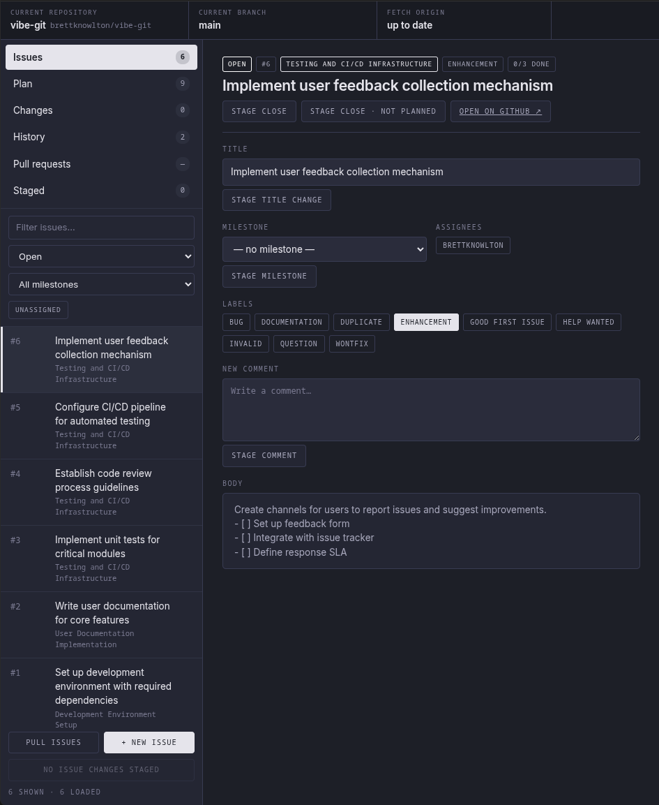
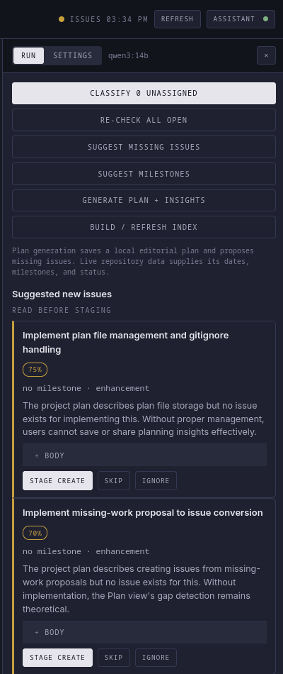
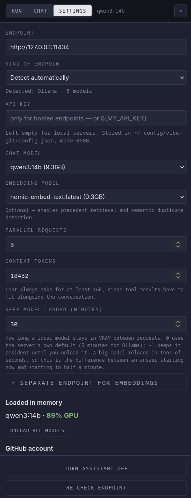

# vibe-git

vibe-git is a lightweight, local Git and GitHub desktop interface built around both
code changes and issues. It runs in a browser on your computer and uses the `git` and
`gh` commands you already have installed.

The project has no third-party runtime dependencies. Issue changes use a reviewable
staging queue, and an optional local-model assistant can help organize project work
without writing directly to GitHub.

vibe-git works with GitHub only. It drives the official `gh` CLI, so GitLab, Bitbucket,
and other self-hosted forges are not supported. GitHub Enterprise Server is untested.

## Quick start

Requires Node.js 18+, Git 2.23+, and [GitHub CLI](https://cli.github.com/) 2.30+
authenticated with the `repo` scope (add `read:org` if you assign issues to organization
members). Check your scopes with `gh auth status`.

```bash
git clone https://github.com/brettknowlton/vibe-git.git
cd vibe-git
node server.js --dry-run
```

Open <http://127.0.0.1:11001/>. Dry-run performs real reads but only logs writes, so you
can click through everything safely. Restart without `--dry-run` when you are ready.

Then open the repository menu in the top-left, add or clone a repository, select it, and
press **Pull issues**. Repositories without a GitHub remote can still use local Git
features.


There is no install or build step; `npm start`, `npm run dry-run`, and `npm test` are
aliases for the same commands.

## Screenshots

Issues are pulled on demand and filtered by state, milestone, assignment, or text. Every
edit in the detail pane stages rather than writing to GitHub.



Issue edits collect in a staging queue showing the exact `gh` command each one will run.
Nothing reaches GitHub until you press **Push**.


The Plan view ranks open issues, explains each ranking, and flags work the project
implies but no issue covers.


Changes shows the working tree with per-file selection and a real diff.


The optional Assistant proposes classifications and missing issues as reviewable
suggestions, never as direct writes.



## Features

### Repository management

- Keep an explicit list of repositories instead of scanning the filesystem on every
  launch.
- Add one repository or add a directory of repositories with a one-time scan.
- Clone from a GitHub URL or `owner/repository` shorthand.
- Switch between recently used repositories from the top bar.
- Remove a repository from the app without deleting anything from disk.

### Working tree and commits

- View every changed, added, deleted, renamed, untracked, or conflicted file.
- Open a full diff for a selected file.
- Select individual files or all changed files for a commit.
- Create commits with a summary and optional description.
- Draft an editable commit subject and description from selected changes when the
  Assistant is available.
- Discard selected changes behind a confirmation step.
- Amend the most recent commit message.
- Undo the most recent commit with a soft reset, preserving its changes.
- Stash changes, restore the latest stash, and inspect conflict counts after merges.
- Browse recent commit history with commit metadata, file statistics, and full patches.

File staging is currently whole-file only; per-hunk and per-line staging are not yet
available.

### Branches and synchronization

- See the current branch, upstream, recent local branches, and remote-only branches.
- Create branches, switch branches, and create local copies of remote branches.
- Refuse unsafe branch switching when tracked changes are present.
- Merge another local branch into the current branch.
- Delete branches with confirmation.
- Display ahead and behind counts in the top bar.
- Fetch all remotes and prune deleted remote references.
- Pull with `--ff-only`, preventing an automatic history rewrite.
- Push the current branch and set its upstream automatically when needed.

### Issues

- Pull open and closed issues from GitHub on demand.
- Filter by state, milestone, unassigned status, issue number, or title text.
- View issue state, milestone, labels, assignees, checklist progress, body, and GitHub
  link.
- Create issues with a body, milestone, labels, and assignees.
- Stage title, milestone, label, and assignee changes.
- Stage comments, close actions, and reopen actions.
- Choose between GitHub's `completed` and `not planned` close reasons.

Issue data is cached locally so routine Git operations remain fast. Use **Pull issues**
or **Refresh** when you want the latest GitHub state.

### Staged GitHub changes

GitHub issue edits are not sent immediately. They first enter a queue that works like a
staging area:

- Review the exact `gh` argument list that will be executed.
- Edit a queued operation and have it revalidated.
- Reorder operations before pushing.
- Remove one operation or clear the queue.
- Keep queued work across browser and server restarts.
- Apply changes sequentially and stop at the first failure, leaving the remainder
  staged for review.

Milestone creation is applied before issue edits that depend on those milestones.

### Pull requests

- List open, merged, closed, or all pull requests.
- View the pull request body, author, branches, review state, mergeability, commits,
  changed-file count, additions, deletions, and diff.
- Open a pull request from the current branch.
- Edit the description of an existing pull request.
- Choose the base branch and create a draft pull request.
- Detect an existing pull request for the current branch.
- Require the branch to have an upstream before offering pull request creation.

Unlike issue edits, pull request writes are not staged. Creating a pull request and
saving a description both apply immediately, each behind a two-stage confirm, because
they act on a single artifact rather than a batch of related metadata changes.

### Plan view

The Plan view combines repository metadata, deterministic prioritization, and optional
editorial guidance:

- Display milestones as a timeline with due dates, descriptions, and open-issue counts.
- Rank recommended work and explain why each item is prioritized.
- Filter the full view to one milestone.
- Hide completed recommendations by default, with a **Show hidden** toggle.
- Open real issues directly in the standard issue editor.
- Identify work described by a plan but not represented by an issue.
- Stage a new issue from a missing-work proposal.
- Ignore or restore proposals that should not become issues.

Milestones and issues are joined by their exact milestone title; names do not need a
`Phase N` prefix. Milestone order, due dates, issue membership, checklist progress,
open or closed state, and fallback ranking are computed from live GitHub data. Undated
milestones remain undated instead of receiving an invented schedule.

The Plan view works programmatically whenever a repository has milestones. Choosing
**Generate plan + insights** asks the Assistant for the parts that require judgment:
recommended ordering, rationale, risks, and concrete work implied by the project but
missing from its issue tracker. Proposed gaps include a reviewable issue body and can be
staged directly from the Plan view.

The generated editorial plan is saved automatically under `~/.config/vibe-git/plans/`;
you do not need to create or maintain its JSON schema.

**Insight files are gitignored by default**, because a plan can contain private
schedules, unreleased dates, and repository details — including for repositories other
than the one you are publishing. To publish a reviewed example as
`insights/<owner>__<repository>.json`, you must add your own negation to `.gitignore`;
the entry in this repository only unignores this project's own example. A locally
generated plan always takes precedence over a checked-in one.

That example lives at
[`insights/brettknowlton__vibe-git.json`](insights/brettknowlton__vibe-git.json) and
stores only editorial choices: recommended order, short tags, and rationale. Milestone
bands, dates, and completion state are filled in from live GitHub metadata.

### Optional local-model Assistant

The Assistant works with an Ollama-compatible HTTP endpoint and is disabled until it is
configured. It can:

- Classify unorganized issues using existing milestone descriptions and labels.
- Re-check all open issues, including issues that already have milestones.
- Suggest milestones for work that does not fit the current structure.
- Suggest missing issues using the tracker and an available planning document.
- Generate the Plan view's editorial ordering, explanations, risks, and missing-work
  issue drafts in one action.
- Summarize selected working-tree changes into an editable commit-message draft.
- Use an optional embedding model to retrieve similar issues as classification
  precedents.
- Remember ignored suggestions so they are not repeatedly proposed.
- Unload selected models when they are no longer needed.

The generated plan is local editorial data. The Assistant never writes to GitHub
directly: classifications and missing-work issue drafts must still be reviewed, staged,
and pushed through the same queue as manual issue changes. Commit summaries only fill
the existing commit form; they never stage files or create a commit.

When available, planning context is read from common project files such as `PLAN.md`,
`ROADMAP.md`, `TODO.md`, and their `docs/` variants. `README.md` is used as a fallback
when no dedicated planning document exists.

## Configuration

vibe-git uses the account that `gh` is already authenticated as and stores no GitHub
credentials of its own. On a shared machine it therefore acts as whoever is signed in.

The Assistant additionally requires an Ollama-compatible model server, and is disabled
until configured.

Removing a repository from the app removes only its entry; the folder and its files stay
on disk and it can be added again later.

### Command-line options

| Option | Description |
|---|---|
| `--dry-run` | Allow reads and log writes without executing them |
| `--port N` | Use a loopback port other than `11001` |
| `--repo PATH` | Select a repository at startup |
| `--scan DIR` | Add a repository path to the initial repository list |

The `VIBE_GIT_PORT` environment variable can also set the default port.

## Typical workflow

1. Select a repository and branch.
2. Review files in **Changes**, select the intended files, and commit them.
3. Pull issues and use the filters to find the relevant work.
4. Open an issue and stage any desired metadata, comment, or state changes.
5. Review, edit, and reorder those operations in **Staged**.
6. Push the queue to GitHub.
7. Fetch, pull, or push Git commits from the synchronization menu.
8. Open or review a pull request from **Pull requests**.

## Assistant setup

1. Open **Assistant** from the top bar.
2. Select **Settings**.
3. Enable Assistant features.
4. Enter the Ollama-compatible endpoint.
5. Select a chat model and, optionally, an embedding model.
6. Adjust concurrency or other model settings if required.
7. Return to **Run** and choose an action.



Only configure an endpoint you trust. Issue bodies, planning documents, and explicitly
selected file diffs may be sent to that endpoint when Assistant actions run.

## Local data and privacy

Application data is stored under:

```text
~/.config/vibe-git/
```

This includes the repository list, settings, staged issue queue, generated plans,
ignored suggestions, and embedding cache. Newly created configuration files use
owner-only permissions.

This path is used on every platform and does not follow `XDG_CONFIG_HOME`, macOS
`Application Support`, or Windows `AppData` conventions. vibe-git is developed and
tested on Linux; it should run anywhere Node.js, Git, and `gh` do, but other platforms
are not regularly verified.

vibe-git has no telemetry. Depending on the action, it communicates only with:

- Git remotes configured in the selected repository;
- GitHub through the authenticated `gh` command; and
- the Assistant endpoint configured in settings.

## Security model

vibe-git can modify repositories and GitHub data, so it is intended for one trusted
user on a local computer.

- The server binds to `127.0.0.1` only.
- Page and API requests validate `Host` and `Origin` values.
- Every API request requires a random token generated at startup.
- The startup token is injected under a Content Security Policy nonce.
- External processes use `execFile` with argument arrays and `shell: false`.
- There is no endpoint that accepts an arbitrary command string.
- Branches, issue numbers, labels, milestones, assignees, and changed-file paths are
  validated before use.
- Untrusted repository and model text is rendered without executable HTML.
- Destructive actions use confirmation steps, and GitHub issue writes use the staging
  queue.
- Pull is fast-forward only.

Do not expose the server to a network or use it as a hosted multi-user service without
adding a separate authentication and authorization layer.

## Troubleshooting

### GitHub features are unavailable

Confirm with `gh auth status` that the CLI is authenticated and has the `repo` scope, and
that the selected repository has a GitHub remote named `origin`. Then press **Refresh**
or **Pull issues**.

### The issue list is stale

Press **Pull issues** or the top-bar **Refresh** button. Background working-tree polling
does not contact GitHub.

### A branch cannot be switched or pulled

Commit, stash, or discard tracked changes first. A diverged branch cannot be pulled
automatically because pull uses `--ff-only`; reconcile it with Git before retrying.

### A merge reports conflicts

Resolve the conflicted files in an editor, stage them, and create the merge commit.
vibe-git reports conflicts but does not provide a conflict-resolution editor.

### Assistant actions are slow

Check whether the configured model server is using available hardware acceleration and
whether the selected model fits in available memory. Embedding and classification work
can also be reduced by lowering Assistant concurrency.

## Development

Run the dependency-free test suite with `npm test`.

### Project structure

```text
server.js       HTTP server, API routing, request guards, and static serving
lib/exec.js     subprocess boundary, dry-run handling, and shared validators
lib/git.js      working tree, history, branches, and synchronization
lib/issues.js   GitHub issue reads and normalization
lib/plans.js    deterministic milestone matching, plan hydration, and fallback ranking
lib/prs.js      pull request reads and creation
lib/queue.js    persistent, validated GitHub issue operation queue
lib/repos.js    repository discovery, selection, cloning, and local configuration
lib/llm.js      optional Ollama-compatible Assistant client
web/            dependency-free browser interface
test/           Node test suite
```

## Known limitations

- The remote must be named `origin`. Fork workflows that use a separate `upstream`
  remote are not supported for push, tag, and remote-URL operations.
- Issue fetching is capped at 800 issues per repository. Very large repositories may also
  hit GitHub API rate limits, which surface as `gh` errors; wait for the limit to reset.
- File staging operates on whole files only.
- Merge conflicts require an external editor.
- Repository creation and publishing are not included.
- Force-push, submodule, and Git LFS workflows are not included.
- Pull is fast-forward only by design.
- The server is local-only and does not provide TLS or multi-user authentication.

## License

Released under the [MIT License](LICENSE).
