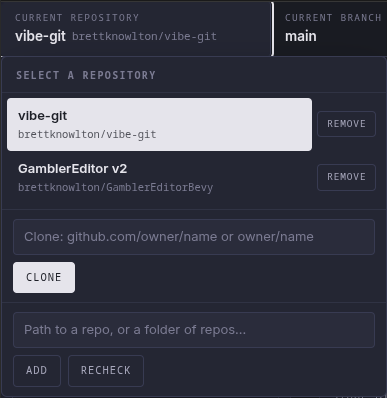
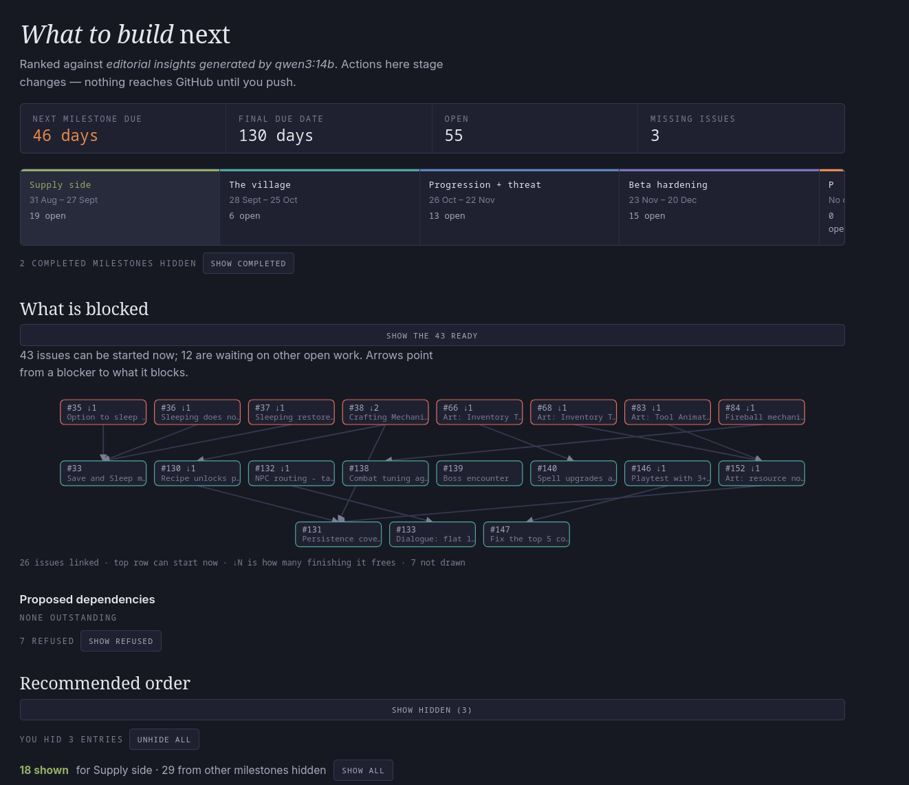
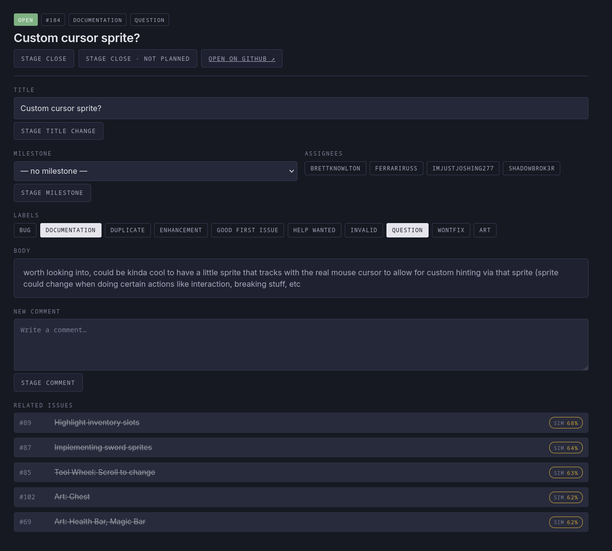
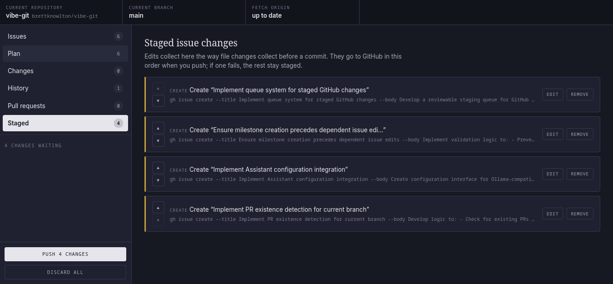
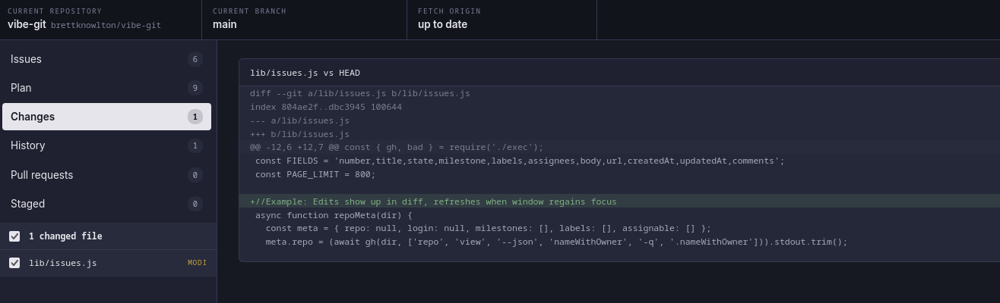
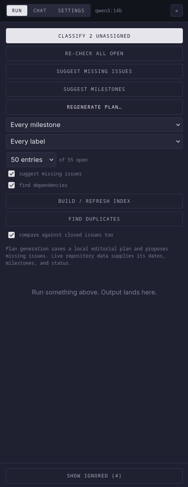

# vibe-git

A local Git and GitHub desktop that treats **issues as first-class work**, not as a website
you leave the editor to visit. It runs in your browser, drives the `git` and `gh` commands
you already have, and has **no third-party runtime dependencies**.

Two ideas run through all of it:

- **Issue changes stage before they apply.** Edits collect in a queue showing the exact `gh`
  command each one will run. Nothing reaches GitHub until you press Push, so a mistake is a
  queue deletion rather than an undo on someone else's tracker.
- **The optional assistant proposes, never writes.** Every classification, plan, dependency
  and draft issue arrives as a card you stage yourself.

GitHub only — it drives the official `gh` CLI, so GitLab, Bitbucket and self-hosted forges
are not supported. GitHub Enterprise Server is untested.

## Quick start

Requires Node.js 18+, Git 2.23+, and [GitHub CLI](https://cli.github.com/) 2.54+ signed in
with the `repo` scope.

```bash
git clone https://github.com/brettknowlton/vibe-git.git
cd vibe-git
node server.js --dry-run
```

Open <http://127.0.0.1:11001/>. Dry-run reads for real and only logs writes, so you can
click through everything safely; restart without the flag when you are ready. There is no
install or build step.

Add a repository from the menu in the top-left, select it, and press **Pull issues**.
Repositories with no GitHub remote still get every local Git feature.



You do not have to get the prerequisites right first. The app checks whether `gh` is
installed, new enough, and signed in, and tells you which of the three is wrong and what to
run — rather than letting it surface as a stray error halfway through an action.

## What it looks like

The **Plan** view ranks your open issues and says why: what blocks what, what a due date
forces, what is nearly finished. Everything on it stages rather than writes.



Issues open in a full editor — metadata, body, the comment thread, and the issues most
similar to this one, so you find the duplicate before you file it.



Edits collect in a staging queue showing exactly what each will run.



**Changes** is the ordinary Git half: working tree, per-file selection, real diffs.



The optional assistant runs batch jobs over the tracker and answers questions about it.



## Overview

Seven views, and a right-hand assistant panel that runs alongside whatever else you are
doing. Each section below links to its own page.

### [Issues →](docs/issues.md)

Pull open and closed issues, filter by state, milestone, label, assignee or meaning, and
edit anything about them. Search is hybrid: plain words match text, a phrase matches
meaning. The detail pane shows the comment thread, what an issue is waiting on, and what it
unblocks. New issues start from the repository's own templates. A `◆` marks issues where
somebody is plausibly waiting on you, and after a pull the view says what changed while you
were away.

Covers: filtering and search, templates, comments, bulk edits, keyboard shortcuts, the
staging queue, catching up.

### [The plan →](docs/plan.md)

A ranked answer to "what should I do next", built from milestones, due dates, checklist
progress and the tracker's dependency structure — drawn as a layered graph. The ordering is
deterministic; only the reasoning and the missing-work proposals come from a model. You can
hide an entry, refuse a dependency, or scope the whole plan to one milestone or label, and
those decisions survive regeneration.

Covers: ranking, dependencies, hiding and refusing, scoping, staleness.

### [Git, branches and pull requests →](docs/git.md)

Working tree, commits, stashes, branches, sync, and history — which reads two ways, as the
commit log or as the tracker's own timeline of issues filed, closed and commented on.
Images in a diff are shown as pictures. Pull requests can be listed, read, opened and
edited.

Covers: commits, branches, synchronization, history, image previews, pull requests.

### [Resolving conflicts →](docs/conflicts.md)

A view that appears only while a merge is half-finished, built around naming the sides.
During a rebase `HEAD` means the opposite of what most people assume, so nothing here says
"ours" or "theirs" — each side is labelled with the branch it came from, the role it plays,
and which is newer.

Covers: side labelling, per-conflict and whole-file actions, marker-less conflicts, image
conflicts, assistant suggestions.

### [The assistant →](docs/assistant.md)

Optional, off until configured, and works against Ollama, any OpenAI-compatible server, or
Anthropic. It classifies issues, drafts missing work, proposes dependencies, finds
duplicates with no model call at all, and answers questions in a chat panel that reads your
source before claiming something is unbuilt.

Covers: setup, endpoints, keys, embeddings, keeping a local model warm, duplicate
detection, chat.

### [Configuration, privacy and security →](docs/configuration.md)

Where data lives, what leaves your machine, command-line options, scripting a running
instance, and reaching it from another device over Tailscale.

Covers: config paths, CLI flags, `tools/vibe.js`, remote access, the security model.

### [Troubleshooting →](docs/troubleshooting.md)

What to do when GitHub features are unavailable, a pull will not fast-forward, or assistant
actions are slow — plus the current known limitations.

### [Development →](docs/development.md)

Project structure and the dependency-free test suite.

## Typical workflow

1. Select a repository and branch.
2. Review files in **Changes**, select the intended ones, and commit.
3. Pull issues and filter to the work that matters.
4. Open an issue and stage metadata, comment or state changes.
5. Review and reorder them in **Staged**.
6. Push the queue to GitHub.
7. Fetch, pull or push commits from the synchronization menu.
8. Open or review a pull request.

## License

Released under the [MIT License](LICENSE).
